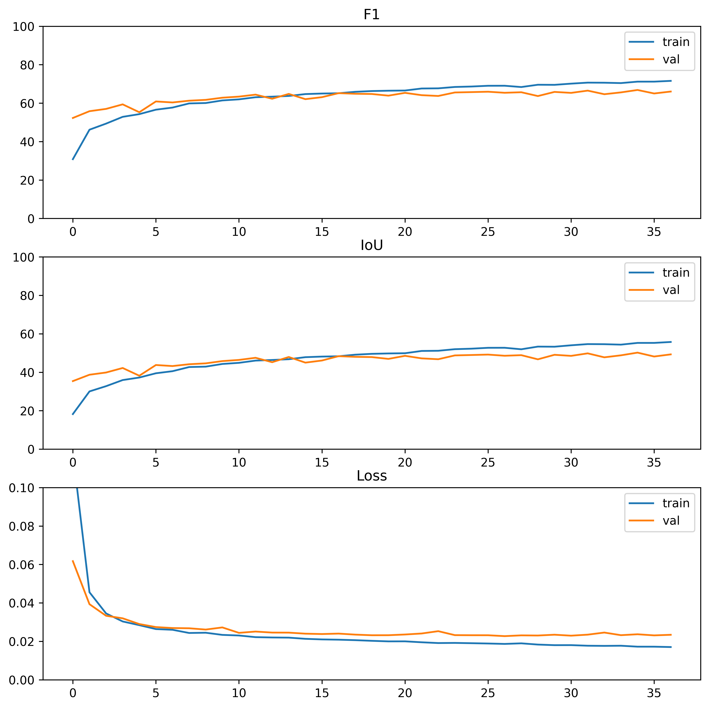

## CDNeXt: Remote Sensing Image Change Detection Based on Temporospatial Interactive Attention Module  

A PyTorch 1.8 implementation of CDNeXt with the TIAM and different backbone
* The CDNeXt framework:  


<!--    -->

* The Temporospatial Interactive Attention Module (TIAM):  

<!--  {:width:"100px"} -->

---

### Requirements


1. Python >= 3.7
2. [PyTorch](https://pytorch.org/get-started/locally/) >= 1.8.2
3. torchvision >=0.9.2
4. numpy
5. opencv-python
6. matplotlib
7. tqdm
8. prettytable
9. pillow

---
### Usage

### 0. Data Preparation
All image data are sliced to 256×256 pixels. The datasets are placed in the "datasets" folder and organized as follows:
```
datasets
    ┣━LEVIR-CD+
    ┃    ┣━train
    ┃    ┃    ┣━T1
    ┃    ┃    ┣━T2
    ┃    ┃    ┗━label
	┃    ┣━val
    ┃    ┃    ┣━T1
    ┃    ┃    ┣━T2
    ┃    ┃    ┗━label
    ┃    ┗━test
    ┃         ┣━T1
    ┃         ┣━T2
    ┃         ┗━label
    ┣━S2Looking
    ┃    ┗━...
    ┣━SYSU-CD
    ┃    ┗━...
    ┗━...
```

### 1. Training
In the *train.py* file, you can set the variable *backboneName* to use another backbone network:  
```python
backboneName = "tiny" #'tiny','small','base','resnet18'
```  

In the *cdnext.py* file, you can set the variable *isTemporalAttention* to use Temporospatial Interactive Attentive Module (TIAM) in which encoder layers, The other variables are in the __init__ function as well.
*self.SpatiotemporalAttentionModule* sets which TIAM module is enabled.
```python
isTemporalAttention = [1,2,3,4] 
# or [0,1,2,3] uses last 3 layers in Bi-features.
isCBAM=[0,0,0,0]
isNonlocal=[0,0,0,0]
self.SpatiotemporalAttentionModule = SpatiotemporalAttentionFull 
#SpatiotemporalAttentionBase  SpatiotemporalAttentionFull  SpatiotemporalAttentionFullNotWeightShared
```  
train CDNeXt model like this:
>   python train.py


### 2. Test
In the *test.py* file, you can set the variable *model_path* to use trained model, run eval process like this:  
>   python eval.py

### Experiments

Performance changes of the main metrics during the training process. LEVIR-CD+ results and S2Looking results, respectively.
<table rules="none" align="center">
	<tr>
		<td>
			<center>
				
				<br/>
				<font color="">LEVIR-CD+ results</font>
			</center>
		</td>
		<td>
			<center>
				
				<br/>
				<font color="">S2Looking resultsg</font>
			</center>
		</td>
	</tr>
</table>